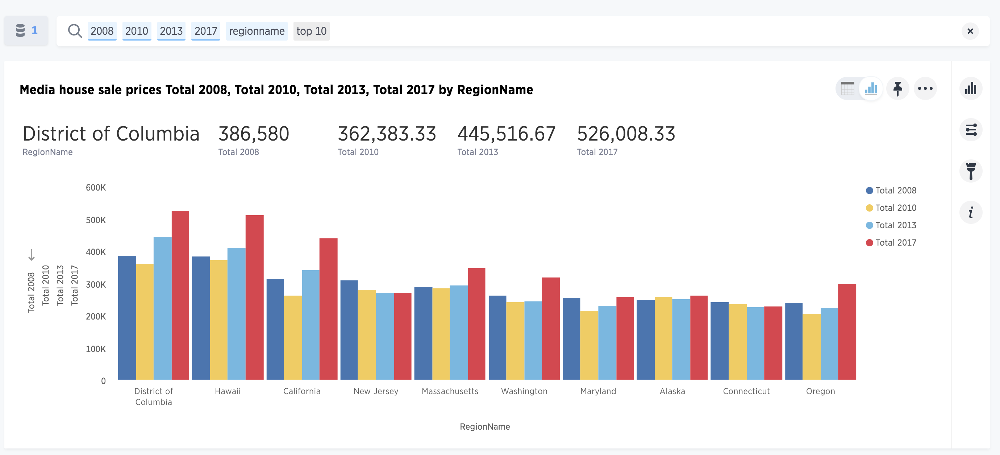
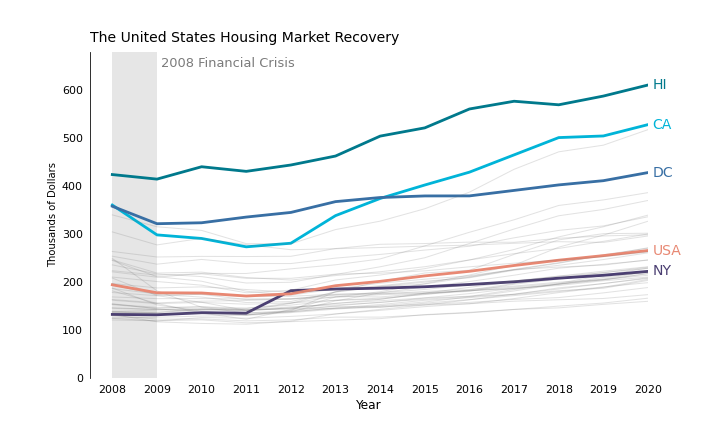
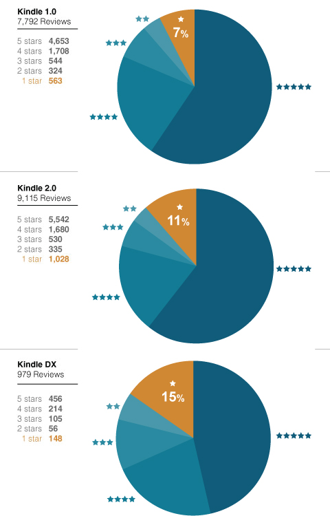
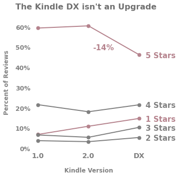

# Plot Redesigns
This project was a part of my Data Visualization course for my Master's in Data Science program. The goal was to find a few different plots and redesign them to be more elegant and understandable. I chose two plots, one of housing prices in the United States and the other of Amazon Kindle reviews. The notebook `redesign.ipynb` contains all of my work to make the changes.

# Housing Prices
## Original Plot

## Redesign

This plot was a part of an analysis on rising homelessness, however, I chose to simply focus on the data that this plot presented as a standalone remark on housing prices. The multiple bar chart was truly hard to understand and it was not easy to compare different states' median prices as the original artist intended. I decided to use a line chart and change the axes the original plot was built on. It didn't make sense to use different states on the x axis when time series data is involved. The first big issue I had was that the dataset associated with the plot was missing 10 US states, a few of which appeared in the original plot. I decided to plot data on the 40 states that I did have and then highlight the few that appeeared in the original. The second issue was that the original plot only used data from for years at uneven intervals, 2008, 2010, 2013, and 2017. It doesn't make sense to plot time series data with uneven time gaps, so I plotted all years from 2008-2020 to observe a smooth, realistic passage through time. I used the Gestalt principle of enclosure by drawing a light grey rectangle over the 2008 financial crisis because the original author was trying to show how housing prices sank after this crisis, but then rose quickly in the following years. Finally, I highlighted a few US states with very large urban populations, which also appeared in the original. I used darker blue colors for highlighted states which contrasted from the orange line, the average median sale price over all states. Overall, this plot shows us that while most states prices either stayed the same or slightly suffered, California's housing market plummeted in the years following the 2008 financial crisis, but nearly all states have had steadily increasing housing prices since 2013.

# Kindle Reviews
## Original Plot

## Redesign

After looking at the pie charts for this data, I could start to see that they were trying to show how well received the newest Kindle model was. From the pie charts, its hard to compare the different percentages of ratings besides the 1 star reviews which are directly labeled. I thought that since versions roll out with time, it could be interesting to see the change in customer satisfaction (number of reviews per star) as a slopegraph would help us understand more how the products were received with each new version. First, I had to build the data. I created a dictionary with the raw number of reviews per star per kindle version and normalized to get a percent of total reviews. Then, I plotted each type of review (per star type) over the three versions, 1.0, 2.0, and DX. The original charts highlighted only one star reviews, but the slopegraph revealed a startling statistic: the Kindle DX had the lowest percentage of 5 star reviews across all three models. I decided to highlight this decrease with color and also marked the 14% decline with a simple annotation. I also highlighted the percentage of 1 star reviews as the original artist did to show the rising level of dissatisfaction from version 1.0 to the DX. Overall, this slopegraph shows us that the Kindle DX was not as well received as its previous iterations, and 1 star ratings have steadily, almost linearly, increased since the first Kindle.